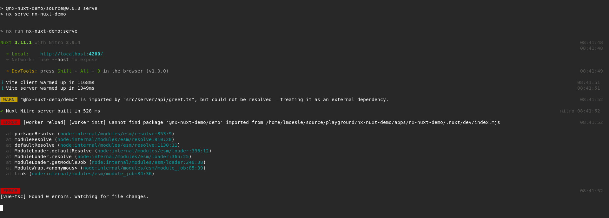

# NxNuxtDemo

> Issue has been resolved by creating an alias for the lib in the nuxt config. See https://github.com/nrwl/nx/issues/22410#issuecomment-2072085078

This project is a demo to reproduce an issue with the @nx/nuxt plugin ([see](https://github.com/nrwl/nx/issues/22410)).

## Steps to reproduce

> I used the defaults for all prompts when creating the Nx workspace and the lib.

1. Create a new Nx workspace with the following command: `npx create-nx-workspace@latest nx-nuxt-demo --preset=nuxt`
2. Create a plain typescript lib with: `npx nx g lib`
3. Install packages with `npm install`
4. Run the app with `npx nx serve nx-nuxt-demo` or `npm run serve`
5. Import the lib in the nuxt server part: e.g. [apps/nx-nuxt-demo/src/server/api/greet.ts](apps/nx-nuxt-demo/src/server/api/greet.ts) 
6. The following error occurs in the console:
```bash
 ERROR  [worker reload] [worker init] Cannot find package '@nx-nuxt-demo/demo' imported from /home/lmoesle/source/playground/nx-nuxt-demo/apps/nx-nuxt-demo/.nuxt/dev/index.mjs 
```


